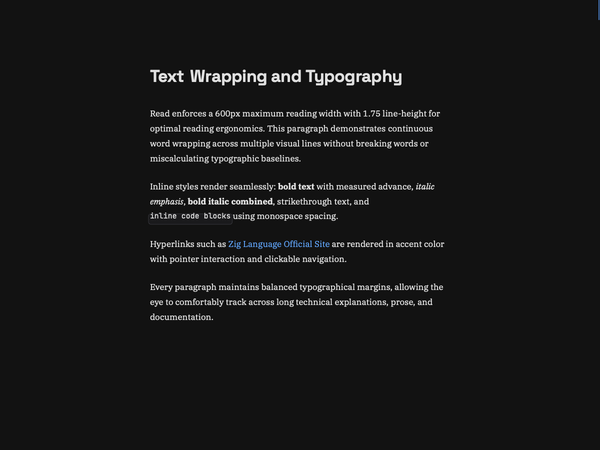

# Read

[](https://github.com/gregoreesmaa/read/actions/workflows/ci.yml)
[](LICENSE)
[](https://ziglang.org)

> **Read** — an ultra-minimalist, zero-dependency, microsecond-grade Markdown reader in pure Zig with a native macOS Cocoa/CoreText layer.

A **zig markdown reader** that opens files with zero-copy **mmap**, scans lines with branchless
**SIMD**, lays out only the visible viewport in **microseconds**, and renders native **Core Text**
typography on **macOS**. No Electron, no WebKit, no UI toolkit, no package dependencies.



## Try it (30 seconds)

macOS + Zig 0.16:

```bash
zig build -Doptimize=ReleaseFast && ./zig-out/bin/read showcase.md
```

`j`/`k` scroll · `Space` page down · `t` toggle theme · `q` quit.
Full controls: [docs/keys.md](docs/keys.md). Why this exists: [VISION.md](VISION.md).

## Benchmarks

The numbers below are enforced in CI on every commit, not marketing: each is pinned by
[src/core/strict_benchmarks.zig](src/core/strict_benchmarks.zig) (immutable — a miss means the
implementation gets faster, never the target lower) and the
[ship binary gate](scripts/size_gate.sh). This table is the single claims surface:
no number here is repeated anywhere else in the repo.

| Metric | Typical Electron app | Standard native reader | **Read** |
| :--- | :--- | :--- | :--- |
| **Binary size** | ~180 MB | ~15–35 MB | **< 180 KiB** |
| **Document open** | 350–1,200 ms | 20–60 ms | **≤ 18 µs** (zero-copy `mmap`) |
| **Line scan, 50,000 lines** | ~100 ms | 15–25 ms | **≤ 400 µs (≥ 5.5 GB/s)** |
| **Viewport layout** | 8–16 ms | 1–3 ms | **≤ 8 µs** |
| **Substring search, 50k lines** | ~50 ms | 5–10 ms | **≤ 50 µs** |
| **Deep scroll (line 45k+)** | 8–16 ms | 1–3 ms | **≤ 11 µs** |
| **Line index entry** | — | — | **8 bytes, packed** |
| **Hot-path heap allocations** | Millions | Thousands | **0** |
| **Active memory (MaxRSS)** | 150–400 MB | 30–80 MB | **< 6 MB** |
| **Third-party dependencies** | Hundreds | Multiple toolkits | **0** |

## Learn more

- [showcase.md](showcase.md) — the live demo document (the command above opens it)
- [docs/architecture.md](docs/architecture.md) — how it stays fast
- [docs/spec.md](docs/spec.md) — supported Markdown inventory
- [docs/keys.md](docs/keys.md) — selection, scrolling, keybindings
- [CONTRIBUTING.md](CONTRIBUTING.md) — pre-commit protocol (tests, screenshots, gates)
- [AGENTS.md](AGENTS.md) — contributor contract and immutable targets

## License

MIT — Copyright (c) 2026 Gregor Eesmaa. See [LICENSE](LICENSE).
