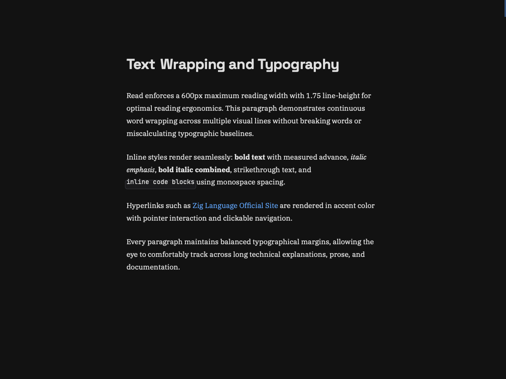

# Read

[](https://github.com/gregoreesmaa/read/actions/workflows/ci.yml)
[](LICENSE)
[](https://ziglang.org)

**The Markdown reader that opens before you blink.** Pure Zig, zero dependencies, native macOS — mmap + SIMD, microsecond rendering, CoreText typography.



```bash
zig build -Doptimize=ReleaseFast && ./zig-out/bin/read showcase.md
```

`j`/`k` scroll · `Space` page · `t` theme · `q` quit · [all keys](docs/keys.md)

## Why

| | Electron app | Native reader | **Read** |
| :--- | :--- | :--- | :--- |
| Binary | ~180 MB | ~15–35 MB | **< 200 KiB** |
| Open | 350–1,200 ms | 20–60 ms | **≤ 18 µs** |
| 50k-line scan | ~100 ms | 15–25 ms | **≤ 400 µs** |
| Viewport layout | 8–16 ms | 1–3 ms | **≤ 8 µs** |
| Deep scroll | 8–16 ms | 1–3 ms | **≤ 11 µs** |
| Hot-path allocs | millions | thousands | **0** |
| Memory | 150–400 MB | 30–80 MB | **< 6 MB** |
| Dependencies | hundreds | toolkits | **0** |

Every number is enforced in CI by [`strict_benchmarks.zig`](src/core/strict_benchmarks.zig) — a miss means the code gets faster, never the target lower.

## What's inside

- Zero-copy `mmap` open, branchless SIMD line scan, virtualized viewport — only visible tokens are parsed ([how it works](docs/architecture.md))
- CommonMark + GFM tables, task lists, math, diagrams, images ([supported Markdown](docs/spec.md))
- Buttery 120 Hz scrolling, native selection & clipboard, dark/light themes ([keys & gestures](docs/keys.md))
- Remote-image privacy guard, on-device math engine ([privacy](docs/privacy.md) · [engine setup](docs/engine.md))

## Docs

**[gregoreesmaa.github.io/read](https://gregoreesmaa.github.io/read/)** — guides, keybindings, Markdown support, examples.

Try: [`showcase.md`](showcase.md) (the one-page tour) · [`examples/`](examples) (classic reference docs) · [`test_cases/`](test_cases) (fixtures behind every screenshot)

Contributing: [CONTRIBUTING.md](CONTRIBUTING.md) · [AGENTS.md](AGENTS.md) · [releases](docs/release.md)

## License

MIT — Copyright (c) 2026 Gregor Eesmaa. See [LICENSE](LICENSE).
