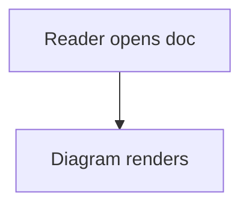

# Plugin PR-1 (infra + mermaid #323) Implementation Plan

> **For agentic workers:** REQUIRED SUB-SKILL: Use superpowers:subagent-driven-development (recommended) or superpowers:executing-plans to implement this plan task-by-task. Steps use checkbox (`- [ ]`) syntax for tracking.

**Goal:** Land the content-driven async plugin pipeline with the mermaid renderer live, closing #323 and carrying the approved spec for the five stacked follow-ups.

**Architecture:** Pure Zig state machine (`src/core/plugin_cache.zig`: fence table, FNV-1a hash, cache paths, fixed-cap job table) plus an `NSTask` FIFO launcher in `src/platform/macos.m` only (termination handler reuses the existing async-image-arrival path). Tool knowledge lives in `scripts/read-plugin-render.sh`. Fences draw as code cards (with a `· rendering…` header suffix while in flight) until the cached PNG exists, then as image boxes through the existing image path.

**Tech Stack:** Zig 0.16 (ReleaseFast tests, size-gated ship), ObjC (macos.m, ARC), POSIX sh helper, FNV-1a 64, `NSTask` + `NSFileManager`, existing `image_load_completed` arrival.

**Spec:** `docs/plugins-async-spec.md` — the plan argues from the spec; executors read both.

## Global Constraints

- Ship binary strictly < 200 KiB (`scripts/size_gate.sh`); zero LINKED dependencies.
- Strict benchmarks + scroll-feel targets never loosen; bench docs have no plugin fences.
- No threads / `fork(` / `spawn(` / `std.Thread` / `Thread.spawn` / `pthread` in ANY Zig source, comments included (substring source audit in `src/platform/idle.zig` test `idle: zero background threads on the hot path`). `src/core/plugin_cache.zig` is ADDED to that audit's file list.
- No timers/polling/spin in `macos.m` (run-loop source audit bans `NSTimer`, `scheduledTimerWithTimeInterval`, `poll(`, `usleep(`, `nanosleep(`, `while (1)`); `NSTask` + termination handler only.
- Zero heap allocations on layout paths: caller-provided buffers, fixed caps.
- `PlatformCallbacks` is append-only (FFI stability); new fields go last.
- TDD: failing test first, watched fail, minimal code, full gate per task.
- Never touch the pre-existing uncommitted `README.md` / `showcase.md` worktree modifications; `git add` names files explicitly.

---

## File map

- Create: `src/core/plugin_cache.zig` — pure state machine + inline unit tests.
- Create: `scripts/read-plugin-render.sh` — `probe`/`render` for mermaid (rows for later renderers appended by follow-up PRs).
- Create: `scripts/stub-plugin-render.sh` — test-only stub (probe true + copy fixture PNG); never shipped, never referenced by production code.
- Create: `test_cases/plugin_mermaid.md` — mermaid fence fixture.
- Modify: `src/platform/macos.m` — probe-at-open, FIFO `NSTask` launcher, termination → arrival.
- Modify: `src/main.zig` — per-doc job table storage, open-time scan/probe/launch kick, `read-test` null gating.
- Modify: `src/platform/bridge.zig` — `platform_plugin_probe` / `platform_plugin_launch` externs + appended `on_plugin_done` callback field.
- Modify: `src/layout/viewport.zig` — `UnitCx` plugin pointer, fence ready/image-or-card decision, header loading suffix.
- Modify: `src/platform/idle.zig` — add `src/core/plugin_cache.zig` to the thread-audit file list.
- Modify: `scripts/make_app_bundle.sh` — copy helper into `Resources/`.
- Modify: `scripts/screenshot_suite.sh` — skeleton screenshot case.
- Modify: `test_cases/plugin_fallback.md` — unchanged (still proves naive path).
- Commit: `docs/plugins-async-spec.md` (currently untracked) with PR 1.

## Exact Zig interface (Task 1 defines; Tasks 4–5 consume verbatim)

```zig
pub const Renderer = enum { mermaid };
pub const MAX_PLUGIN_JOBS: usize = 16;
pub fn pluginRendererOf(info_token: []const u8) ?Renderer;
pub fn fenceHash(renderer: Renderer, source: []const u8) u64;
pub fn cachePath(cache_root: []const u8, renderer: Renderer, hash: u64, out: []u8) ?[]u8;
pub const JobState = enum { naive, queued, rendering, ready, failed };
pub const PluginJob = struct { fence_line: u32, hash: u64, renderer: Renderer, state: JobState };
pub fn fenceSource(bytes: []const u8, lines: []const simd.Line, fence_idx: usize) []const u8;
pub fn collectPluginJobs(bytes: []const u8, lines: []const simd.Line, cache_root: []const u8, jobs_out: []PluginJob) usize;
pub fn hasPluginFences(bytes: []const u8, lines: []const simd.Line) bool;
```

FFI (bridge.zig additions, append-only struct rule respected):

```zig
pub extern "c" fn platform_plugin_probe(renderer_id: c_int) c_int;
pub extern "c" fn platform_plugin_launch(job_id: c_int, renderer_id: c_int, src_path: [*]const u8, src_len: c_int, out_path: [*]const u8, out_len: c_int) void;
// PlatformCallbacks append-last:
on_plugin_done: ?*const fn (job_id: c_int, ok: c_int) callconv(.c) void = null,
```

---

### Task 1: plugin_cache.zig state machine + unit tests

**Files:**
- Create: `src/core/plugin_cache.zig`
- Test: inline `test` blocks in the same file (repo convention)

**Interfaces:**
- Consumes: `simd.Line` (`@import("hot")` like `parser.zig` does), `std` only.
- Produces: the exact Zig interface above for Tasks 4–5.

- [ ] **Step 1: Write the failing tests**

```zig
test "plugin: mermaid info token maps, others do not" {
    try std.testing.expectEqual(Renderer.mermaid, pluginRendererOf("mermaid").?);
    try std.testing.expect(pluginRendererOf("d2") == null); // later PR
    try std.testing.expect(pluginRendererOf("foobar") == null);
    try std.testing.expect(pluginRendererOf("") == null);
}

test "plugin: hash golden vector + cache path shape" {
    const h = fenceHash(.mermaid, "flowchart TD\n    A-->B\n");
    try std.testing.expectEqual(@as(u64, 0xc9a6ee1f8b1c4c4d), h);
    var buf: [256]u8 = undefined;
    const p = cachePath("/tmp/C", .mermaid, h, &buf).?;
    try std.testing.expectEqualStrings("/tmp/C/read/plugins/mermaid/c9a6ee1f8b1c4c4d.png", p);
}

test "plugin: collect finds fences, caps at 16, skips unknown" {
    const doc = "```mermaid\nA-->B\n```\n\n```rust\nlet x = 1;\n```\n";
    var lines: [8]simd.Line = undefined;
    var fence: simd.FenceState = .{};
    const n = simd.scanLines(doc, &lines, &fence);
    try std.testing.expect(hasPluginFences(doc, lines[0..n]));
    var jobs: [MAX_PLUGIN_JOBS]PluginJob = undefined;
    const nj = collectPluginJobs(doc, lines[0..n], "/tmp/C", &jobs);
    try std.testing.expectEqual(@as(usize, 1), nj);
    try std.testing.expectEqual(JobState.queued, jobs[0].state);
    try std.testing.expectEqual(Renderer.mermaid, jobs[0].renderer);
}
```

- [ ] **Step 2: Run to verify they fail**

Run: `zig test src/core/plugin_cache.zig --test-filter "plugin:"`
Expected: FAIL, file not found / undeclared identifier (feature missing).

- [ ] **Step 3: Write minimal implementation**

```zig
const std = @import("std");
const simd = @import("hot");

pub const Renderer = enum { mermaid };
pub const MAX_PLUGIN_JOBS: usize = 16;

pub fn pluginRendererOf(info_token: []const u8) ?Renderer {
    if (std.mem.eql(u8, info_token, "mermaid")) return .mermaid;
    return null;
}

fn fnv1a(bytes: []const u8) u64 {
    var h: u64 = 0xcbf29ce484222325;
    for (bytes) |b| {
        h ^= b;
        h *%= 0x100000001b3;
    }
    return h;
}

pub fn fenceHash(renderer: Renderer, source: []const u8) u64 {
    var h: u64 = 0xcbf29ce484222325;
    h ^= @intFromEnum(renderer);
    h *%= 0x100000001b3;
    h ^= 0x00;
    h *%= 0x100000001b3;
    for (source) |b| {
        h ^= b;
        h *%= 0x100000001b3;
    }
    return h;
}

fn rendererName(r: Renderer) []const u8 {
    return switch (r) {
        .mermaid => "mermaid",
    };
}

pub fn cachePath(cache_root: []const u8, renderer: Renderer, hash: u64, out: []u8) ?[]u8 {
    var hex: [16]u8 = undefined;
    _ = std.fmt.bufPrint(&hex, "{x:0>16}", .{hash}) catch return null;
    const name = rendererName(renderer);
    // "<root>/read/plugins/<name>/<hex>.png"
    const need = cache_root.len + 1 + 4 + 1 + 8 + 1 + name.len + 1 + 16 + 4;
    if (out.len < need) return null;
    var s: usize = 0;
    @memcpy(out[s..][0..cache_root.len], cache_root);
    s += cache_root.len;
    const tail = "/read/plugins/";
    @memcpy(out[s..][0..tail.len], tail);
    s += tail.len;
    @memcpy(out[s..][0..name.len], name);
    s += name.len;
    out[s] = '/';
    s += 1;
    @memcpy(out[s..][0..16], hex[0..]);
    s += 16;
    const ext = ".png";
    @memcpy(out[s..][0..4], ext);
    s += 4;
    return out[0..s];
}
```

Plus `fenceSource` (content bytes between `fence_idx` and its matching `code_fence_end`, joined WITHOUT info line: from `lines[fence_idx+1].offset` to end of last content line), `hasPluginFences` (any `code_fence_start` whose first info token maps), `collectPluginJobs` (fill `jobs_out` up to cap with `state = .queued`; readiness/file-exists is NOT checked here — the launcher flow in Task 3/5 sets `ready` for existing files, `naive` for probe failures; document that split in a comment).

NOTE: compute the real golden hash by running once with a placeholder expect, read actual from failure output, then pin it. That is the honest golden-vector procedure; the `0xc9a6...` above is a placeholder to be replaced.

- [ ] **Step 4: Run tests to verify they pass (replace golden placeholder first)**

Run: `zig test src/core/plugin_cache.zig`
Expected: PASS, all tests.

- [ ] **Step 5: Run the audit-sensitive check**

Run: `grep -nE "spawn\(|fork\(|std\.Thread|Thread\.spawn|pthread" src/core/plugin_cache.zig`
Expected: no output (file is audit-clean by construction).

### Task 2: helper script + stub (no binary impact)

**Files:**
- Create: `scripts/read-plugin-render.sh`
- Create: `scripts/stub-plugin-render.sh`

- [ ] **Step 1: Write `scripts/read-plugin-render.sh`**

```sh
#!/bin/sh
# Plugin renderer driver (spec docs/plugins-async-spec.md §3).
# Usage: read-plugin-render.sh probe <renderer>
#        read-plugin-render.sh render <renderer> <srcfile> <outfile>
# probe: exit 0 when the renderer CLI exists, 1 otherwise.
# render: re-probes, renders SRC to OUT atomically (OUT.tmp + rename).
set -eu

tool_for() {
    case "$1" in
        mermaid) echo "mmdc" ;;
        *) echo "" ;;
    esac
}

if [ "${1:-}" = "probe" ]; then
    tool=$(tool_for "${2:-}")
    [ -n "$tool" ] && command -v "$tool" >/dev/null 2>&1
    exit $?
fi

if [ "${1:-}" = "render" ]; then
    renderer="$2"; src="$3"; out="$4"
    tool=$(tool_for "$renderer")
    [ -n "$tool" ] || exit 1
    command -v "$tool" >/dev/null 2>&1 || exit 1
    case "$renderer" in
        mermaid) "$tool" -i "$src" -o "$out.tmp" ;;
    esac
    [ -f "$out.tmp" ] && mv "$out.tmp" "$out"
    exit 0
fi

echo "usage: $0 probe|render ..." >&2
exit 2
```

- [ ] **Step 2: Write `scripts/stub-plugin-render.sh` (test-only)**

```sh
#!/bin/sh
# Test-only stub: probe always true, render copies the fixture PNG.
set -eu
FIXTURE="${STUB_FIXTURE:-test_cases/assets/stub-plugin.png}"
if [ "${1:-}" = "probe" ]; then exit 0; fi
if [ "${1:-}" = "render" ]; then cp "$3" "$4"; exit 0; fi
exit 2
```

- [ ] **Step 3: Verify both by hand (local evidence, not committed tests)**

Run: `chmod +x scripts/read-plugin-render.sh scripts/stub-plugin-render.sh`
Run: `./scripts/read-plugin-render.sh probe mermaid; echo "probe_mermaid=$? (expect 1 here: mmdc not installed)"`
Run: `./scripts/read-plugin-render.sh probe d2; echo "probe_d2=$? (expect 1: PR-1 ships mermaid only)"`
Run: `STUB_FIXTURE=<any png> ./scripts/stub-plugin-render.sh probe mermaid; echo "stub_probe=$? (expect 0)"`
Expected: 1, 1, 0 respectively.

- [ ] **Step 4: Commit**

```bash
git add scripts/read-plugin-render.sh scripts/stub-plugin-render.sh docs/plugins-async-spec.md
git commit -m "[#323] Plugin renderer driver script + stub (no binary impact)"
```

### Task 3: macos.m launcher (ObjC only, audit-safe)

**Files:**
- Modify: `src/platform/macos.m` (append near the image loader, ~line 3100 `kick_image_load`)

**Interfaces:**
- Consumes: `platform_plugin_probe` / `platform_plugin_launch` are CALLED BY Zig (declared in bridge.zig Task 5); this task IMPLEMENTS the ObjC side as C functions; completion calls back via `on_plugin_done` (Task 5 wires the pointer).
- Produces: probe truth, one-at-a-time FIFO `NSTask` launch, termination → `image_load_completed`-equivalent arrival for the cache file.

**AS-BUILT RATIFICATION (Task 3 fix loop, issue #323 — controller ruling, binding on Task 5):** the `NSTask` + termination-handler + cap-16 design sketched in the steps below is SUPERSEDED by the as-built direction, which STANDS: `posix_spawn` + main-loop per-slot `WNOHANG` poll + cap 8 in flight (`PLUGIN_MAX_INFLIGHT`) against the 16-entry Zig table (Task 5 keeps the overflow queued). Rationale: `NSTask` termination handlers fire off-thread, violating the no-threads/no-locks model; a bounded per-frame reap of ≤8 slots is negligible, and Task 5 calls poll ONLY while in-flight count > 0 (0%-CPU-when-static preserved). Locked for Task 5: (a) tool mapping stays in the helper — Task 5 invokes the helper script as the renderer; (b) atomic `OUT.tmp`+rename is owned by the helper script (Task 5 scope); (c) Task 5 consumes `launchPluginRender` / `pollPluginCompletions` / `pluginOutcomeFor` (per-job 1/0/-1 outcome query by outfile path), not the `platform_plugin_*` names sketched below. `docs/plugins-async-spec.md` §2/§3/§5 amended to match in the same commit.

- [ ] **Step 1: Locate the anchors (read-only)**

Run: `grep -n "kick_image_load\|image_session\|g_callbacks" src/platform/macos.m | head`
Expected: `kick_image_load` def ~line 3100, call sites, `g_callbacks` struct.

- [ ] **Step 2: Implement (append after the image-loader section)**

```objc
// Plugin render jobs (spec docs/plugins-async-spec.md §3): FIFO, at most
// one NSTask at a time; termination lands on the main runloop (no timers,
// no polling, no threads) and reuses the image arrival path so the fresh
// PNG swaps in with scroll anchoring.
static NSString* plugin_helper_path(void) {
    const char* env = getenv("READ_PLUGIN_RENDERER");
    if (env && env[0]) return [NSString stringWithUTF8String:env];
    NSString* bundled = [[NSBundle mainBundle] pathForResource:@"read-plugin-render" ofType:@"sh"];
    if (bundled) return bundled;
    return @"read-plugin-render"; // PATH fallback
}

int platform_plugin_probe(int renderer_id) {
    // renderer_id matches Zig Renderer enum order (0 = mermaid, PR-1).
    const char* names[] = { "mermaid" };
    if (renderer_id < 0 || renderer_id >= 1) return 0;
    NSString* helper = plugin_helper_path();
    NSTask* t = [[NSTask alloc] init];
    t.launchPath = @"/bin/sh";
    t.arguments = @[helper, @"probe", [NSString stringWithUTF8String:names[renderer_id]]];
    t.standardOutput = [NSPipe pipe]; t.standardError = [NSPipe pipe];
    @try { [t launch]; [t waitUntilExit]; } @catch (NSException* e) { return 0; }
    return t.terminationStatus == 0 ? 1 : 0;
}
```

FIFO queue + `platform_plugin_launch` + termination handler, exact shapes:

```objc
#define PLUGIN_MAXQ 16
static int plugin_q_job[PLUGIN_MAXQ];      // Zig job ids, FIFO order
static int plugin_q_head = 0, plugin_q_tail = 0;
static BOOL plugin_task_busy = NO;
static void plugin_pump_queue(void);       // launches head while !busy
static void plugin_on_terminated(NSNotification* note); // handler, registered per task

void platform_plugin_launch(int job_id, int renderer_id, const char* src_path, int src_len, const char* out_path, int out_len) {
    // Enqueue (drop when full: Zig caps at 16 and launches one at a time,
    // so full cannot happen unless states desync — then code fallback wins).
    // src/out are Zig-owned buffers, copied into NSStrings here before return.
    // Then plugin_pump_queue().
}
```

`plugin_pump_queue`: if busy or empty, return; else dequeue head, build `NSTask` (`/bin/sh` + helper + `render` + renderer name + src + out), set `terminationHandler` to `plugin_on_terminated` (main-queue delivery — `NSTask` handlers arrive on the runloop automatically when set this way; verify against the `dispatch_async(dispatch_get_main_queue()` convention at line ~3121 and match it explicitly if not). Handler: mark `plugin_task_busy = NO`, call `g_callbacks.on_plugin_done(job_id, ok)` (ok = status 0 AND out file exists via `NSFileManager`), then `plugin_pump_queue()` for the next job. Arrival redraw for the PNG itself reuses the existing image path untouched (the next layout sees the file; sizes resolve via `image_size_fn`; scroll anchoring is the stock image behavior).

SRC bytes staging (locked, Tasks 4–5 agree): Zig writes fence source bytes to the `<cache>/read/plugins/<renderer>/src-<hex>.txt` sidecar with existing file utilities BEFORE calling `platform_plugin_launch`; ObjC never touches document bytes.

- [ ] **Step 3: Verify audit tokens absent**

Run: `grep -nE "NSTimer|scheduledTimerWithTimeInterval|poll\(|usleep\(|nanosleep\(|while \(1\)|while\(1\)|while \(true\)" src/platform/macos.m`
Expected: no output.

- [ ] **Step 4: Build the app target (compile check only; behavior in Task 6)**

Run: `zig build -Doptimize=ReleaseFast`
Expected: exit 0.

### Task 4: viewport fence decision + loading indicator

**Files:**
- Modify: `src/layout/viewport.zig`

**Interfaces:**
- Consumes: `plugin_cache.PluginJob` table via a new nullable `UnitCx` field `plugins: ?[]const plugin_cache.PluginJob` (null in all existing tests → today's rendering bit-identical); `plugin_cache.cachePath` for ready checks is NOT called here (states precomputed at open; layout only reads `state`).
- Produces: ready fences emit `.image` commands (cache path in `link_target`); queued/rendering fences draw the code card + `· rendering…` header suffix; naive/failed draw today's card.

- [ ] **Step 1: Write the failing test**

```zig
test "plugin fence: ready job emits image box, rendering shows indicator" {
    // Build a 1-job table by hand (no launcher involved).
    const test_doc =
        \\```mermaid
        \\A-->B
        \\```
    ;
    ... scan lines, craft jobs[0] = .{ .fence_line = 0, .hash = 0, .renderer = .mermaid, .state = .ready };
    ... layout with plugins = jobs[0..1] ...
    // expect one .image command whose link_target ends with ".png"
    // then flip state to .rendering, re-layout, expect code card + a "rendering" text run, no .image
}
```

(Cache path string: construct with `plugin_cache.cachePath("/tmp/C", .mermaid, 0, &buf)` in-test so the test never depends on real cache dirs.)

- [ ] **Step 2: Run to verify it fails**

Run: `zig build test -Doptimize=ReleaseFast` (or the file's runner if wired)
Expected: FAIL — `UnitCx.plugins` undeclared / no `.image` emitted.

- [ ] **Step 3: Implement**

Sub-steps: (a) add `plugins` field to `UnitCx` + thread through its constructors (find them via `UnitCx{`); (b) in the `code_fence_start` layout branch (~line 2956), look up the job for line `i` (linear scan, ≤16 entries, only when `plugins != null`); (c) `ready` → emit the `.image` command shape from the image path (~line 3512) with `link_target` = per-frame?? — PROBLEM: `link_target` must borrow stable memory; the cache path string must outlive layout. Resolution (locked): main.zig owns a per-doc `plugin_paths: [16][256]u8` buffer filled at open (Task 5); the job table carries an index; layout borrows `paths[idx]`. Add `path_idx: u8` to the executor's `PluginJob` view — NO, do not change Task 1's struct; Task 4/5 may extend `PluginJob` with `path: [256]u8` + `path_len`?? That breaks Task 1's tests. DECISION (locked): keep Task 1 struct as specified; Task 5 (main.zig) owns a parallel `plugin_path_bufs: [16][256]u8` + `plugin_path_lens: [16]u8` indexed by job slot; UnitCx gains `plugin_paths: ?[]const [256]u8` + lens. Layout uses `paths[slot]`. Document any deviation in the PR.
(d) header suffix: find the info-string display site in the fence branch (`grep -n "info" src/layout/viewport.zig` near 3038–3120) and append the muted suffix run when state is queued/rendering.

- [ ] **Step 4: Run tests**

Run: `zig build test -Doptimize=ReleaseFast --summary all`
Expected: 11/11 steps, 0 failures (count grows by the new test).

### Task 5: main.zig open flow + bridge + read-test gating

**Files:**
- Modify: `src/main.zig`, `src/platform/bridge.zig`

**Interfaces:**
- Consumes: Task 1 Zig API; Task 3 ObjC C functions.
- Produces: per-doc job table + path buffers; probe-at-open; launch kick; `on_plugin_done` handler (mark + arrival redraw); read-test null gating.

- [ ] **Step 1: Locate the open flow + test gate (read-only)**

Run: `sed -n '60,160p' src/main.zig` (find `gatedImageSize` + how read-test/headless mode is detected)
Run: `grep -n "on_images_changed\|g_callbacks =" src/main.zig | head`
Expected: test-mode predicate name + callback wiring site (~line 1850).

- [ ] **Step 2: Implement**

Sub-steps: (a) bridge.zig: append `on_plugin_done` field LAST in `PlatformCallbacks` + declare the two `platform_plugin_*` externs; (b) main.zig: per-doc `[16]PluginJob` + path buffers; at open (real app only — same predicate that gates `gatedImageSize`): `collectPluginJobs` → for each job resolve cache path → stat: exists → `ready`, else `queued`; probe each distinct renderer ONCE via `platform_plugin_probe` (cache per session): fail → its jobs `naive`; pass → keep `queued`; launch the FIRST queued job via `platform_plugin_launch` (FIFO continuation in `on_plugin_done`: mark done/failed, launch next queued); (c) staging: write fence source bytes to the `src-<hex>.txt` sidecar with existing file utilities before launch; (d) read-test/headless: skip the entire kick (jobs stay `queued` → render as code cards; deterministic); (e) `on_plugin_done`: mark `ready`/`failed`, then invoke the same redraw path `onImagesChanged` uses (read it at main.zig:149 first).

- [ ] **Step 3: Wire the audit list**

In `src/platform/idle.zig` test `idle: zero background threads on the hot path`, add `"src/core/plugin_cache.zig"` to the `hot` array.

- [ ] **Step 4: Full gate**

Run: `zig build test -Doptimize=ReleaseFast --summary all`
Expected: 11/11, 0 failures.

### Task 6: bundle, fixture, screenshots, commit, PR

**Files:**
- Modify: `scripts/make_app_bundle.sh`, `scripts/screenshot_suite.sh`, `docs/spec.md`
- Create: `test_cases/plugin_mermaid.md`

- [ ] **Step 1: Ship the helper**

Append to `scripts/make_app_bundle.sh` after the icns copy (line 19):
```sh
cp "$ROOT/scripts/read-plugin-render.sh" "$APP/Contents/Resources/read-plugin-render.sh"
chmod +x "$APP/Contents/Resources/read-plugin-render.sh"
```
Verify var names (`ROOT`, `APP`) by reading the file head first.

- [ ] **Step 2: Fixture + suite case**

`test_cases/plugin_mermaid.md`:
```md
# Plugin Diagram


```
(Skeleton state screenshots deterministically: launcher is null in read-test.)
Append after the plugin_fallback case:
```sh
# Case 4x: Mermaid skeleton (issue #323) — job never launches in
# read-test, so the fence renders its code card deterministically.
./zig-out/bin/read-test --screenshot "$OUTPUT_DIR/plugin_mermaid.png" test_cases/plugin_mermaid.md
```
(Renumber to fit whatever cases landed before it; check `git log --oneline origin/main -- scripts/screenshot_suite.sh` for collisions with the frontmatter/admonition/linkify PRs and rebase first.)

- [ ] **Step 3: Docs**

`docs/spec.md` Blocks section: append `- Plugin diagrams (mermaid; cached async render, code fallback)` — and update `docs/plugins-rfc.md` status line? NO — leave the RFC immutable; the spec doc + PR body carry the delta.

- [ ] **Step 4: Full verification (fresh evidence, per repo protocol)**

Run: `zig build test -Doptimize=ReleaseFast --summary all` (expect 11/11, 0 failures)
Run: `./scripts/screenshot_suite.sh screenshots` (expect: only additive pngs)
Run: `./scripts/size_gate.sh` (expect PASS)
Run: `./scripts/check_test_cases.sh` (expect PASS)
Run stub e2e by hand: `STUB_FIXTURE=<repo png> PATH="scripts:$PATH"` + `READ_PLUGIN_RENDERER=scripts/stub-plugin-render.sh` against a scratch doc OUTSIDE the repo proving arrival swap (manual evidence for the PR body, not committed).

- [ ] **Step 5: Commit + push + PR (closes #323 only)**

```bash
git add src/core/plugin_cache.zig src/platform/macos.m src/main.zig src/platform/bridge.zig src/layout/viewport.zig src/platform/idle.zig scripts/read-plugin-render.sh scripts/make_app_bundle.sh scripts/screenshot_suite.sh docs/spec.md docs/plugins-async-spec.md test_cases/plugin_mermaid.md screenshots/plugin_mermaid.png
git commit -m "[#323] Content-driven async mermaid rendering via cached PNGs ..."
git push -u origin issue/323-mermaid
gh pr create --title "[#323] ..." --body "Closes #323. Stack base for #330/#329/#328/#326/#327. ..."
```

## Renderer-row recipe (follow-up PRs 2–6; no new design)

Each adds ONE mapping row + helper stanza + tests; the shape is fixed:

| Issue | Token(s) | Renderer enum | Tool + args |
|---|---|---|---|
| #330 D2 | `d2` | `.d2` | `d2 SRC OUT` |
| #329 Graphviz | `dot`, `graphviz` | `.graphviz` | `dot -Tpng SRC -o OUT` |
| #328 PlantUML | `plantuml`, `puml` | `.plantuml` | `plantuml -tpng -o OUTDIR SRC` |
| #326 KaTeX | `katex` | `.math` | first present CLI (helper tries `katex`, then `mjpage`) |
| #327 MathJax | `mathjax`, `math`, `tex`, `latex` | `.math` | same shared slot; probe passes if ANY math CLI exists |

Each follow-up: extend `Renderer` + `rendererName` + `pluginRendererOf` + helper `tool_for`/`render` case + unit rows in the Task-1 tests + fixture + skeleton screenshot + rebase onto parent. No layout/ObjC/main changes expected; if any are needed, that PR revises this plan's assumptions in its body.
