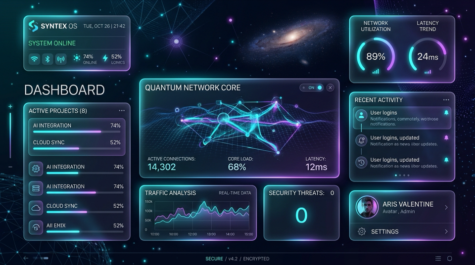
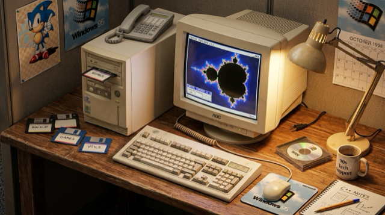

# Read: The Comprehensive Markdown Showcase

Welcome to **Read**, the zero-dependency, microsecond-grade reader. This document tests and demonstrates the full typographic and parsing capabilities of the engine.

---

## 1. Typography & Inline Elements

Normal paragraph text supports rich inline styling. Here is an example combining **bold text**, *italic text*, ***bold and italic text***, ~~strikethrough~~, and `inline code spans`.

You can also have [hyperlinks to ziglang.org](https://ziglang.org) embedded directly within sentences.

Here is a second paragraph demonstrating automatic word wrapping across multiple lines. When text exceeds the maximum reading column width of 740 pixels, the layout engine automatically breaks lines between words without breaking character runs or miscalculating typographic advances. Every line snaps strictly to the baseline grid for effortless readability.

---

## 2. Heading Hierarchy

# Heading Level 1
## Heading Level 2
### Heading Level 3
#### Heading Level 4
##### Heading Level 5
###### Heading Level 6

---

## 3. Blockquotes

> "Simplicity is a prerequisite for reliability."
> — Edsger W. Dijkstra

> Nested blockquotes provide visual depth:
> > "Perfection is achieved, not when there is nothing more to add, but when there is nothing left to take away."
> > — Antoine de Saint-Exupéry

---

## 4. Lists

### Unordered Lists
- Hardware-accelerated text rendering
- Direct zero-copy virtual memory paging
- Branchless SIMD block classification
  - Sub-item with vector alignment
  - Another nested point
- Instantaneous cold launch

### Ordered Lists
1. First step: Memory map the input file
2. Second step: Scan line breaks using vector instructions
3. Third step: Calculate visible viewport layout
4. Fourth step: Submit draw calls to native OS framebuffer

### Task Lists / Checkboxes
- [x] Zero external library dependencies
- [x] Sub-millisecond cold start
- [x] Virtualized viewport rendering
- [x] Text selection and system clipboard copying
- [ ] Multi-tab document switcher
- [ ] Analytical GPU Bézier curve rasterizer

---

## 5. Code Blocks

Here is a block of Zig source code:

```zig
const std = @import("std");

pub fn main() void {
    const stdout = std.io.getStdOut().writer();
    stdout.print("Zero dependencies. Microsecond speed.\n", .{}) catch {};
}
```

And a shell command block:

```bash
# Build optimized release binary
zig build -Doptimize=ReleaseFast

# Open the comprehensive showcase
./zig-out/bin/read showcase.md
```

---

## 6. Tables

| Feature | Read | Standard Reader | Browser / Electron |
| :--- | :--- | :--- | :--- |
| **Startup Time** | **< 2 ms** | 40 – 80 ms | 350 – 1,200 ms |
| **Active RAM** | **< 6 MB** | 30 – 60 MB | 150 – 400 MB |
| **Binary Size** | **184 KB** | 15 – 30 MB | 120 – 220 MB |
| **Dependencies** | **0** | 10 – 30 | 800+ packages |

---

## 7. Horizontal Rules & Separators

Three or more hyphens, asterisks, or underscores produce horizontal divider lines:

---

***

Enjoy pure, distraction-free reading.

---

## 8. Images & Media Formats

Read supports all major image and vector formats through zero-dependency native OS graphics pipeline:

### Scalable Vector Graphics (SVG)


### Portable Network Graphics (PNG)


### Photographic JPEG


### Modern WebP


### Graphics Interchange Format (GIF) — Static Palette


### Animated GIF — Rotating Earth (44 frames, public domain)

Animated GIFs are loaded via native ImageIO. Source: Wikimedia Commons.


### High Efficiency Image Container (HEIC)


### Tagged Image File Format (TIFF)


### Windows Bitmap (BMP)

