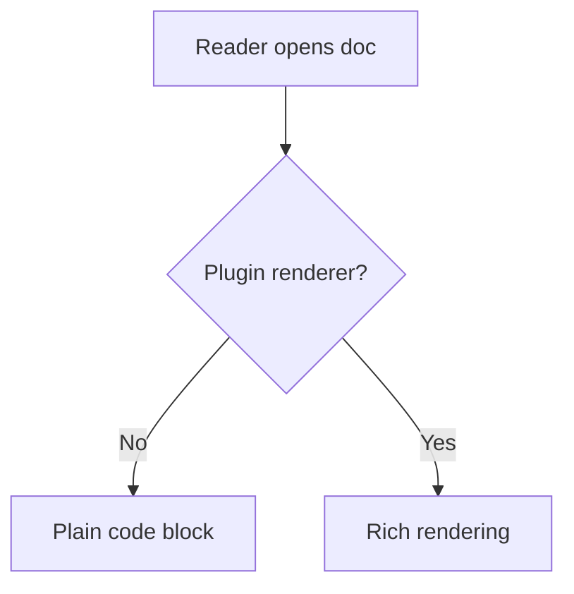

# Plugin Fallback Rendering

Fences naming plugin languages with no renderer render as plain code blocks,
source intact, info string visible — never silently absorbed (see
`docs/plugins-rfc.md`).



```math
\sum_{i=1}^{n} i = \frac{n(n+1)}{2}
```

```foobar-diagram
this unknown language also falls back to a plain code block
```
