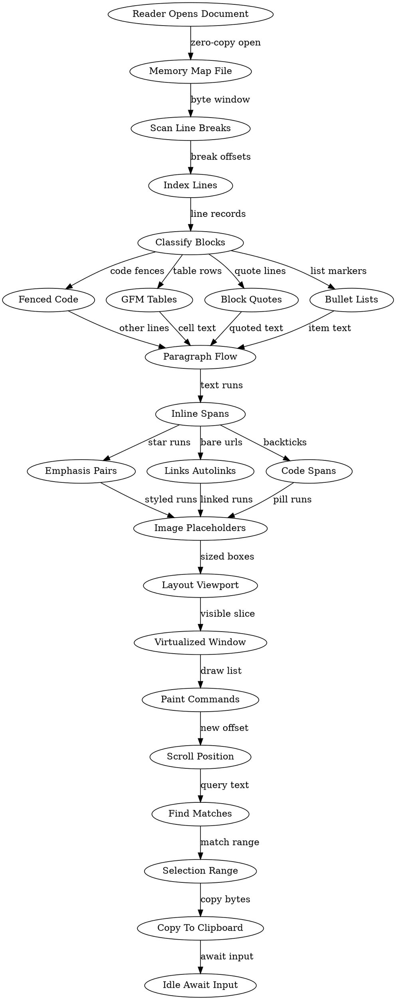

# Tall Graphviz Diagram

```dot
digraph {
    rankdir = TB;
    reader [label="Reader Opens Document"];
    mmap [label="Memory Map File"];
    scan [label="Scan Line Breaks"];
    lines [label="Index Lines"];
    blocks [label="Classify Blocks"];
    fence [label="Fenced Code"];
    table [label="GFM Tables"];
    quote [label="Block Quotes"];
    list [label="Bullet Lists"];
    para [label="Paragraph Flow"];
    spans [label="Inline Spans"];
    emph [label="Emphasis Pairs"];
    link [label="Links Autolinks"];
    code [label="Code Spans"];
    image [label="Image Placeholders"];
    layout [label="Layout Viewport"];
    view [label="Virtualized Window"];
    paint [label="Paint Commands"];
    scroll [label="Scroll Position"];
    find [label="Find Matches"];
    select [label="Selection Range"];
    copy [label="Copy To Clipboard"];
    idle [label="Idle Await Input"];

    reader -> mmap [label="zero-copy open"];
    mmap -> scan [label="byte window"];
    scan -> lines [label="break offsets"];
    lines -> blocks [label="line records"];
    blocks -> fence [label="code fences"];
    blocks -> table [label="table rows"];
    blocks -> quote [label="quote lines"];
    blocks -> list [label="list markers"];
    fence -> para [label="other lines"];
    table -> para [label="cell text"];
    quote -> para [label="quoted text"];
    list -> para [label="item text"];
    para -> spans [label="text runs"];
    spans -> emph [label="star runs"];
    spans -> link [label="bare urls"];
    spans -> code [label="backticks"];
    emph -> image [label="styled runs"];
    link -> image [label="linked runs"];
    code -> image [label="pill runs"];
    image -> layout [label="sized boxes"];
    layout -> view [label="visible slice"];
    view -> paint [label="draw list"];
    paint -> scroll [label="new offset"];
    scroll -> find [label="query text"];
    find -> select [label="match range"];
    select -> copy [label="copy bytes"];
    copy -> idle [label="await input"];
}
```
