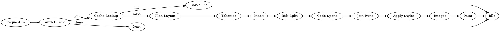

# Wide Graphviz Diagram

```dot
digraph {
    rankdir = LR;
    in [label="Request In"];
    auth [label="Auth Check"];
    cache [label="Cache Lookup"];
    deny [label="Deny"];
    serve [label="Serve Hit"];
    plan [label="Plan Layout"];
    tok [label="Tokenize"];
    idx [label="Index"];
    bidi [label="Bidi Split"];
    code [label="Code Spans"];
    join [label="Join Runs"];
    style [label="Apply Styles"];
    img [label="Images"];
    paint [label="Paint"];
    idle [label="Idle"];

    in -> auth;
    auth -> cache [label="allow"];
    auth -> deny [label="deny"];
    cache -> serve [label="hit"];
    cache -> plan [label="miss"];
    plan -> tok;
    tok -> idx;
    idx -> bidi;
    bidi -> code;
    code -> join;
    join -> style;
    style -> img;
    img -> paint;
    paint -> idle;
    deny -> idle;
    serve -> idle;
}
```
