# Many Diagrams

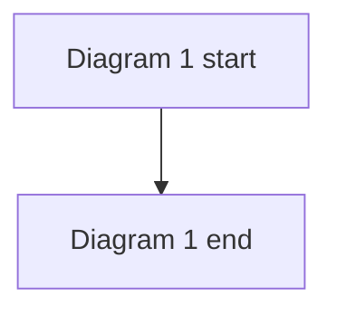
```mermaid
flowchart TD
    A1[Diagram 1 start] --> B1[Diagram 1 end]
```

```mermaid
flowchart TD
    A2[Diagram 2 start] --> B2[Diagram 2 end]
```

```mermaid
flowchart TD
    A3[Diagram 3 start] --> B3[Diagram 3 end]
```

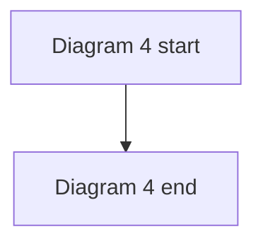
```mermaid
flowchart TD
    A4[Diagram 4 start] --> B4[Diagram 4 end]
```

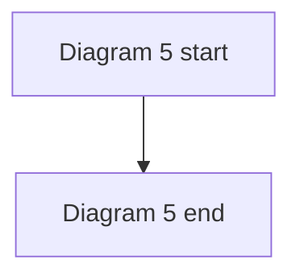
```mermaid
flowchart TD
    A5[Diagram 5 start] --> B5[Diagram 5 end]
```

```mermaid
flowchart TD
    A6[Diagram 6 start] --> B6[Diagram 6 end]
```

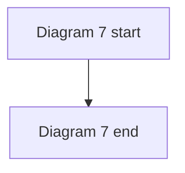
```mermaid
flowchart TD
    A7[Diagram 7 start] --> B7[Diagram 7 end]
```

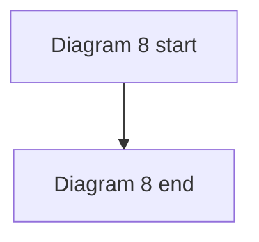
```mermaid
flowchart TD
    A8[Diagram 8 start] --> B8[Diagram 8 end]
```

```mermaid
flowchart TD
    A9[Diagram 9 start] --> B9[Diagram 9 end]
```

```mermaid
flowchart TD
    A10[Diagram 10 start] --> B10[Diagram 10 end]
```

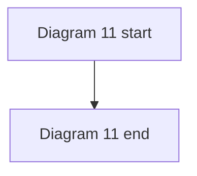
```mermaid
flowchart TD
    A11[Diagram 11 start] --> B11[Diagram 11 end]
```

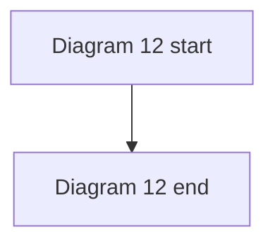
```mermaid
flowchart TD
    A12[Diagram 12 start] --> B12[Diagram 12 end]
```

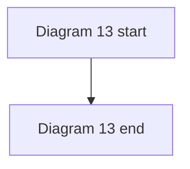
```mermaid
flowchart TD
    A13[Diagram 13 start] --> B13[Diagram 13 end]
```

```mermaid
flowchart TD
    A14[Diagram 14 start] --> B14[Diagram 14 end]
```

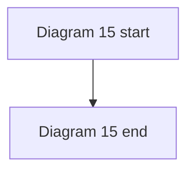
```mermaid
flowchart TD
    A15[Diagram 15 start] --> B15[Diagram 15 end]
```

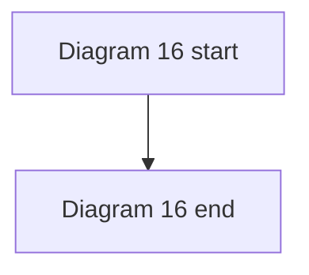
```mermaid
flowchart TD
    A16[Diagram 16 start] --> B16[Diagram 16 end]
```

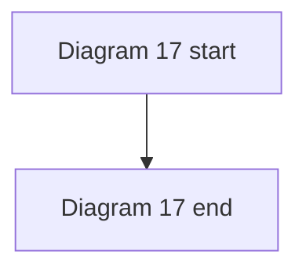
```mermaid
flowchart TD
    A17[Diagram 17 start] --> B17[Diagram 17 end]
```

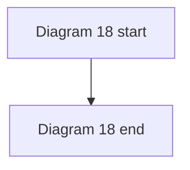
```mermaid
flowchart TD
    A18[Diagram 18 start] --> B18[Diagram 18 end]
```

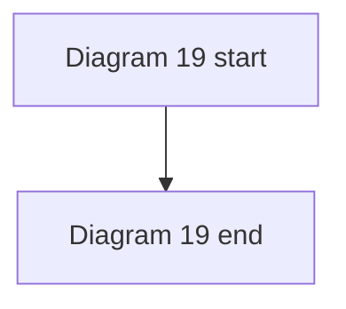
```mermaid
flowchart TD
    A19[Diagram 19 start] --> B19[Diagram 19 end]
```

```mermaid
flowchart TD
    A20[Diagram 20 start] --> B20[Diagram 20 end]
```
