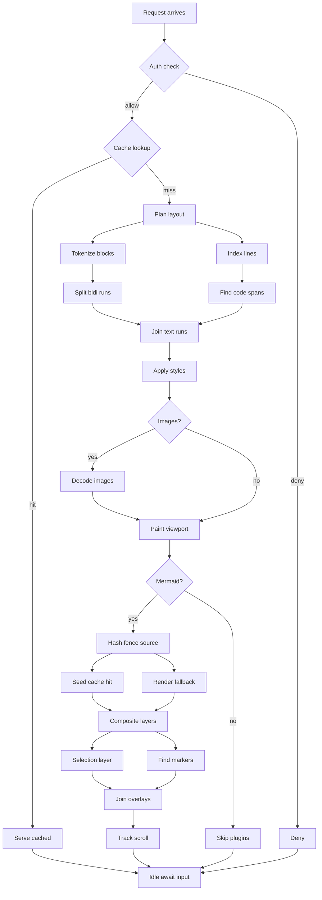

# Tall Diagram

```mermaid
flowchart TD
    IN[Request arrives] --> AUTH{Auth check}
    AUTH -- allow --> CACHE{Cache lookup}
    AUTH -- deny --> DENY[Deny]
    CACHE -- hit --> SERVE[Serve cached]
    CACHE -- miss --> PLAN[Plan layout]
    PLAN --> TOK[Tokenize blocks]
    PLAN --> IDX[Index lines]
    TOK --> BIDI[Split bidi runs]
    IDX --> CODE[Find code spans]
    BIDI --> JOIN1[Join text runs]
    CODE --> JOIN1
    JOIN1 --> STYLE[Apply styles]
    STYLE --> IMG{Images?}
    IMG -- yes --> DECODE[Decode images]
    IMG -- no --> PAINT[Paint viewport]
    DECODE --> PAINT
    PAINT --> PLUG{Mermaid?}
    PLUG -- yes --> HASH[Hash fence source]
    PLUG -- no --> SKIP[Skip plugins]
    HASH --> SEED[Seed cache hit]
    HASH --> MISS[Render fallback]
    SEED --> COMP[Composite layers]
    MISS --> COMP
    COMP --> SEL[Selection layer]
    COMP --> FIND[Find markers]
    SEL --> JOIN2[Join overlays]
    FIND --> JOIN2
    JOIN2 --> SCROLL[Track scroll]
    SCROLL --> IDLE[Idle await input]
    DENY --> IDLE
    SERVE --> IDLE
    SKIP --> IDLE
```
