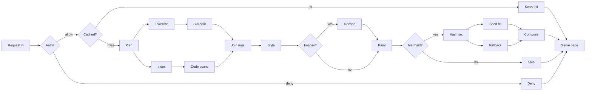

# Wide Diagram

```mermaid
flowchart LR
    IN[Request in] --> AUTH{Auth?}
    AUTH -- allow --> CACHE{Cached?}
    AUTH -- deny --> DENY[Deny]
    CACHE -- hit --> SERVE[Serve hit]
    CACHE -- miss --> PLAN[Plan]
    PLAN --> TOK[Tokenize]
    PLAN --> IDX[Index]
    TOK --> BIDI[Bidi split]
    IDX --> CODE[Code spans]
    BIDI --> JOIN1[Join runs]
    CODE --> JOIN1
    JOIN1 --> STYLE[Style]
    STYLE --> IMG{Images?}
    IMG -- yes --> DECODE[Decode]
    IMG -- no --> PAINT[Paint]
    DECODE --> PAINT
    PAINT --> PLUG{Mermaid?}
    PLUG -- yes --> HASH[Hash src]
    PLUG -- no --> SKIP[Skip]
    HASH --> SEED[Seed hit]
    HASH --> MISS[Fallback]
    SEED --> COMP[Compose]
    MISS --> COMP
    COMP --> OUT[Serve page]
    DENY --> OUT
    SERVE --> OUT
    SKIP --> OUT
```
