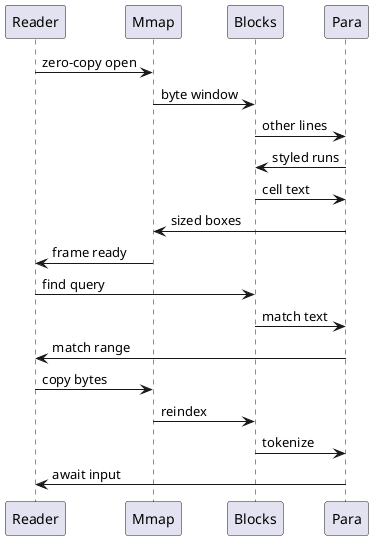

# Tall PlantUML Diagram

```plantuml
@startuml
participant Reader
participant Mmap
participant Blocks
participant Para
Reader -> Mmap: zero-copy open
Mmap -> Blocks: byte window
Blocks -> Para: other lines
Para -> Blocks: styled runs
Blocks -> Para: cell text
Para -> Mmap: sized boxes
Mmap -> Reader: frame ready
Reader -> Blocks: find query
Blocks -> Para: match text
Para -> Reader: match range
Reader -> Mmap: copy bytes
Mmap -> Blocks: reindex
Blocks -> Para: tokenize
Para -> Reader: await input
@enduml
```
