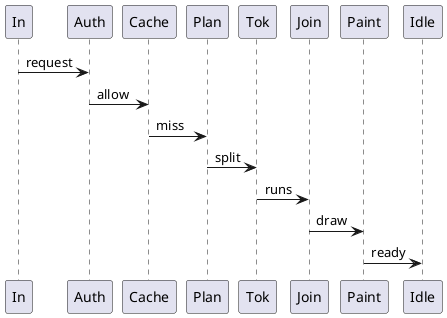

# Wide PlantUML Diagram

```plantuml
@startuml
participant In
participant Auth
participant Cache
participant Plan
participant Tok
participant Join
participant Paint
participant Idle
In -> Auth: request
Auth -> Cache: allow
Cache -> Plan: miss
Plan -> Tok: split
Tok -> Join: runs
Join -> Paint: draw
Paint -> Idle: ready
@enduml
```
